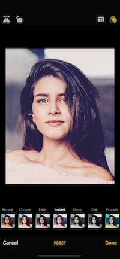

[](https://opensource.org/licenses/mit-license.php)
[](https://developer.apple.com/swift)


Preview the great functionality of the NDImageManager framework with this example app. NDImageManager is a Swift framework for selecting and editing images in a consistent and easy way. This app installs the framework as a Swift Package automatically, pulled directly from its repository. The NDImageManager framework is also open source and available under the MIT License 

[NDImageManager](https://github.com/neone/NDImageManager)

## Description

The NDImageApp is an example app for the NDImageManager framework. NDImageManager consists of three primary functions, selecting images, editing images, and applying filters to images. It can also be provide an image in order to simply utilize the editing and/or available filters


         


## Usage

On the code side of things make sure to import the framework into your Swift file,  and set you ViewController as an NDImageManagerDelegate

```swift
    import NDMageManager
    
    class NDImageAppViewController: UIViewController, NDImageManagerDelegate {}
```

In the example app we configure the manager as both a picker and editor and call it like this.

```swift
    let picker = NDImageManager()
    picker.imagePickerDelegate = self
    picker.setUpImageManager(pickImage: false, editable: isEditable, image: editImage, rounded: isRounded)
    present(picker, animated: true, completion: nil)
```

And finally you will need to implement the protocol delegates

```
swift
    public protocol NDImageManagerDelegate {
        func imageReturned(image: UIImage)
        func pickerCancelled()
    }

```

 If you find any bugs, open a GitHub issue!


## Requirements

NDImageApp requires at least iOS 13.

## Installation

To install the NDImageManager framework in your app simply add it to the Swift Packages of your project settings. No pods, no command line tools. Just a Swift Package :)

## Release Notes

#### 1.0
Initial release

## Authors

Dave Glassco, [GitHub](https://github.com/neodave), Web: [Neone](https://www.neone.com), Twitter: [@daveglassco](https://twitter.com/daveglassco)  
Makoto Mori, [GitHub](https://github.com/makomori),  Twitter: [@makomori26](https://twitter.com/makomori26)  
Mark Moeykens, [GitHub](https://github.com/bigmountainstudio), Web: [Big Mountain Studio](https://www.bigmountainstudio.com)

## License

The NDImageApp is available under the MIT license. See the LICENSE.md file for more info.
